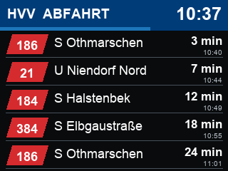
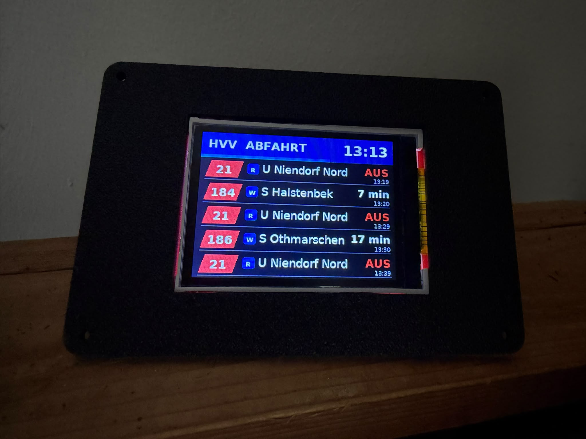
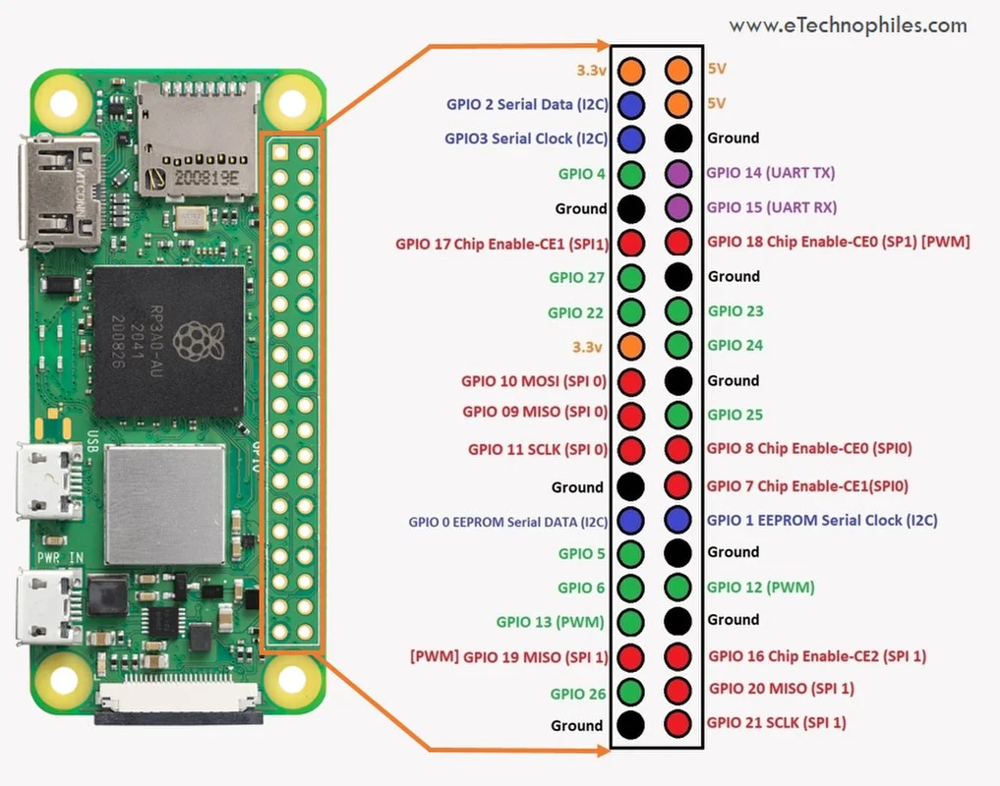
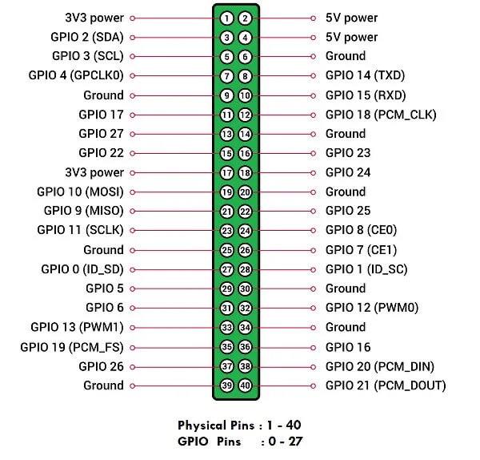
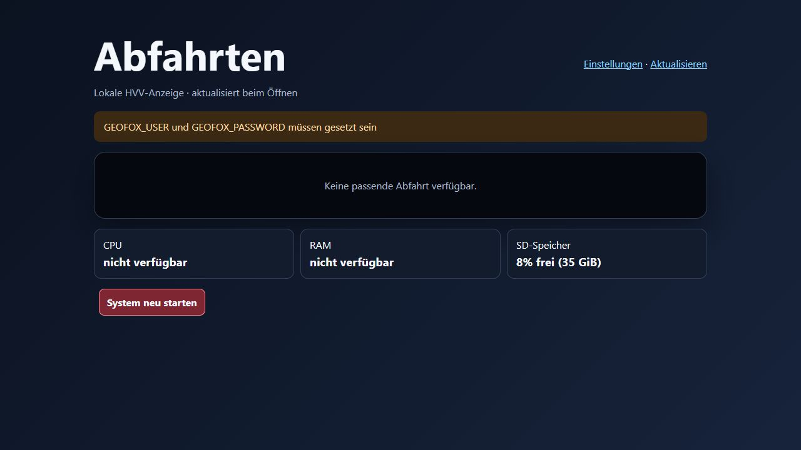
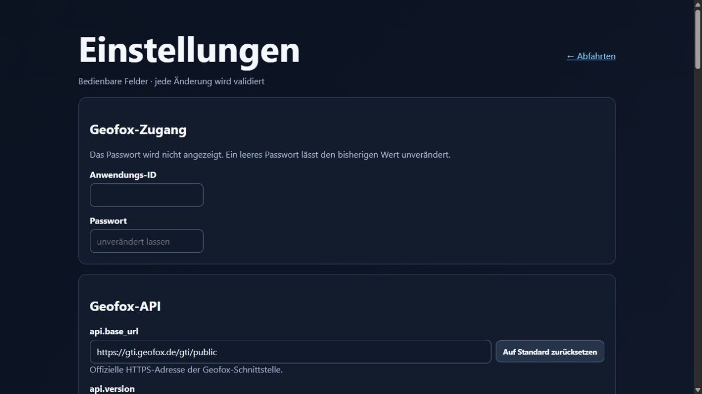
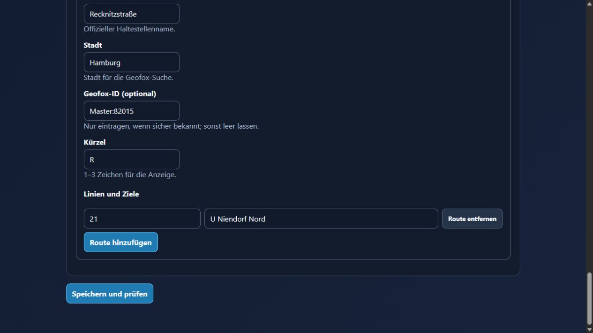

# HVV-Anzeiger für Raspberry Pi

[](https://ko-fi.com/U3D523YISZ)

[](https://github.com/Ben1991/hvv-anzeiger/actions/workflows/ci.yml)
[](LICENSE)

## Wieso gibt es dieses Projekt?

Ich möchte morgens möglichst schnell sehen, wann ich los muss, um meinen Bus oder meine Bahn zu bekommen - ohne auf mein Handy gucken zu müssen.

## Und wie funktioniert es?

Eine kompakte Abfahrtsanzeige für einen Raspberry Pi Zero 2 W oder ein
kompatibles Raspberry-Pi-Modell mit 40-Pin-GPIO und ein
2,2-Zoll-ILI9341-SPI-Display. Sie läuft ohne grafische Oberfläche auf
Raspberry Pi OS Lite, lädt alle 15 Sekunden aktuelle Geofox-Prognosen, filtert
die gewünschten Verbindungen und sortiert sie haltestellenübergreifend nach
der erwarteten Abfahrtszeit.



Das Preview zeigt beispielhafte Abfahrten ab Jungfernstieg in Richtung
Hauptbahnhof. Bus, U-Bahn und S-Bahn werden dabei mit ihren unterschiedlichen
Linienfarben und -formen dargestellt; die angezeigten Zeiten sind illustrativ.

## Praxisbeispiel

Die fertige Anzeige im Einsatz auf einem Raspberry Pi mit 2,2-Zoll-Display:



Die Hülle für den Raspberry Pi und das Display ist 3D-gedruckt und kann bei
[3DprintsByBen auf Etsy](https://3dprintsbybenstudio.etsy.com) bestellt werden.
Alternativ ist eine Bestellung per Nachricht an den Repository-Owner möglich.

> Dieses Repository ist ein unabhängiges Open-Source-Projekt. Es ist kein
> offizielles Produkt von hvv, HOCHBAHN oder Geofox.

## Release Notes

### Release V2.2.2 – einfachere Stations- und Linienauswahl

V2.2.2 macht die Einrichtung von Haltestellen in der Weboberfläche klarer und
schneller:

- eine sichtbare Schrittfolge führt von der Geofox-Haltestellensuche über das
  Laden der Linien bis zum Speichern
- Stadt, Geofox-ID und ein freies Anzeige-Kürzel werden nach der Auswahl eines
  Geofox-Treffers automatisch übernommen
- Linien werden nach Verkehrsmittel gruppiert und können über ein Suchfeld
  gefiltert werden; die Auswahl zeigt jederzeit „x von y ausgewählt“
- die Statusanzeige zeigt den nächsten sinnvollen Schritt und blendet leere
  Suchfelder aus
- Browser-Smoke-Tests prüfen zusätzlich das Laden, Gruppieren und Filtern der
  Linienauswahl

### Release V2.2.1 – überarbeitete V2.2-Release

V2.2.1 veröffentlicht die überarbeitete V2.2-Implementierung mit einem
zusätzlichen End-to-End- und Responsive-Testlauf:

- Geofox-gestützte Haltestellen- und Linienauswahl für Bus, U-Bahn, S-Bahn,
  AKN, Regionalverkehr und Fähre
- Richtungs- und Zielstationsfilter bleiben beim erneuten Laden der Linien
  erhalten
- Geofox-Anfragen werden global serialisiert; HTTP-400-Fehlercodes aus
  Response-Bodies werden verständlich ausgewertet
- Speichermeldungen erscheinen zusätzlich direkt am betroffenen Feld bzw. an
  der Liniengruppe
- responsiver, geschützter `/display`-Modus und mobile Stations-/
  Linienkonfiguration ohne horizontalen Overflow
- Browser-Smoke- und visuelle Regressionstests prüfen Dashboard, Displaymodus,
  Settings, Filterpersistenz und das 390-Pixel-Mobile-Layout
- `web.py` ist in der Coverage-Messung enthalten; die CI läuft mit Python 3.11
- README-Screenshots wurden aus der geprüften Weboberfläche neu erzeugt,
  einschließlich eines Displaybeispiels Jungfernstieg Richtung Hauptbahnhof
- alle GitHub-CI-Gates einschließlich Shell-Installer und CodeQL sind grün

<details>
<summary>Ältere Release Notes anzeigen</summary>

### Version 0.2.2 / V2.2

- Stationsverwaltung über die Weboberfläche für alle von Geofox gemeldeten
  Verkehrsmittel, einschließlich Bus, U-Bahn, S-Bahn, AKN, Regionalverkehr
  und Fähre
- sichere Linienauswahl mit konfigurierbarem Richtungs- oder
  Zielstationsfilter; bestehende manuelle Bus-Konfigurationen bleiben
  kompatibel
- einheitliche, verkehrsmittelabhängige Linienfarben und -formen in Display,
  Web-Dashboard und geschütztem Displaymodus
- konfigurierbare Darstellung mit Countdown oder absoluter Abfahrtszeit,
  wählbarer Countdown-Einheit und optional ausgeblendeten Haltestellenkürzeln
- geschützter, responsiver `/display`-Modus für Kiosk- und Zweitbildschirme
- zusätzliche Sicherheitskorrekturen für Geofox-Anfrageserialisierung und
  nicht-lokale Webzugriffe
- Code of Conduct sowie strukturierte Bug- und Feature-Issue-Templates für
  Beiträge zum Projekt

### Version 0.2.1 / V2.1

- lokal gebundene Weboberfläche unter `http://127.0.0.1:8080`; Zugriff von
  anderen Rechnern per SSH-Tunnel oder mit eigener TLS-Konfiguration
- automatischer Start der Weboberfläche bei Installation und nach jedem Reboot
- Standard-Anmeldung `hvv-anzeiger` / `hvv-anzeiger` für die Ersteinrichtung
- Webpasswort in der Einstellungsseite änderbar; gespeichert wird nur ein
  gesalzener Hash
- README mit Hinweisen zum Deaktivieren und späteren Reaktivieren des
  Webdienst-Autostarts

### Version 0.2.0 / V2

- lokale Weboberfläche mit Abfahrtsanzeige im Display-Stil
- Bearbeitung und Speicherung aller konfigurierbaren Werte einschließlich
  Geofox-Zugangsdaten
- Haltestellen-Autovervollständigung über die Geofox-API mit verständlichem
  Hinweis zu Vollständigkeit und Korrektheit der Vorschläge
- „Auf Standard zurücksetzen“-Schaltflächen für einzelne Konfigurationswerte
- direkte Übernahme gespeicherter Einstellungen ohne Neustart, wenn möglich
- automatische Wiederherstellung der Anzeige nach einem kurzzeitigen
  Display-/SPI-Verbindungsfehler
- Hardware-Übersicht für CPU, RAM und SD-Speicher sowie System-Neustartaktion
- Schutz der Weboberfläche durch CSRF-Prüfung und Token-Authentifizierung bei
  Zugriff außerhalb des lokalen Rechners
- einfaches `update.sh` für sichere Updates aus einem sauberen `main`-Checkout

Die vollständige Installations-, Konfigurations- und Update-Anleitung steht in
den folgenden Abschnitten dieses README.

### Version 0.1.0 / V1

V1 war die erste veröffentlichte Version des HVV-Anzeigers. Sie wurde am
10. August 2026 unter dem unveränderlichen Git-Tag `V1` veröffentlicht.

- [V1 auf GitHub ansehen](https://github.com/Ben1991/hvv-anzeiger/releases/tag/V1)
- [Quellcode von V1 anzeigen](https://github.com/Ben1991/hvv-anzeiger/tree/V1)

</details>

## Inhalt

Für die erste Einrichtung: [Voraussetzungen](#voraussetzungen) →
[Geofox-Zugang beantragen](#geofox-zugang-beantragen) →
[Display anschließen](#display-anschließen) → [Installieren](#installieren).
Für den Alltag sind [Konfigurieren](#konfigurieren) und
[Betrieb und Updates](#betrieb-und-updates) die wichtigsten Abschnitte.

- [Release Notes](#release-notes)
- [Funktionen](#funktionen)
- [Vorkonfigurierte Anzeige](#vorkonfigurierte-anzeige)
- [Voraussetzungen](#voraussetzungen)
- [Geofox-Zugang beantragen](#geofox-zugang-beantragen)
- [Display anschließen](#display-anschließen)
- [Installieren](#installieren)
- [Konfigurieren](#konfigurieren)
- [Betrieb und Updates](#betrieb-und-updates)
- [Fehlerverhalten und Diagnose](#fehlerverhalten-und-diagnose)
- [Ressourcen- und Stromverbrauch](#ressourcen--und-stromverbrauch)
- [Sicherheit und Datenschutz](#sicherheit-und-datenschutz)
- [Projektentwicklung](#projektentwicklung)
- [Grenzen](#grenzen)
- [Haftungsausschluss](#haftungsausschluss)
- [Lizenz und Unterstützung](#lizenz-und-unterstützung)

## Funktionen

- bis zu fünf Abfahrten auf 320 × 240 Pixeln im Querformat
- Linie, Fahrtziel, absolute Uhrzeit und verbleibende Minuten
- gemeinsame chronologische Sortierung über mehrere Haltestellen
- frei konfigurierbare Haltestellen, Linien, Ziele und sichtbare Kürzel
- Bus-, U-Bahn-, S-Bahn-, AKN-, Regional- und Fährverbindungen mit passender
  Linienkennzeichnung
- wahlweise Countdown oder absolute Abfahrtszeit sowie optional ausgeblendete
  Haltestellenkürzel
- Geofox-Echtzeitprognosen einschließlich Verspätungen und Ausfällen
- Aktualisierung im Normalbetrieb alle 15 Sekunden
- sichtbare Hinweise bei fehlendem WLAN, veralteten Daten oder noch nicht
  synchronisierter Systemzeit
- letzter erfolgreicher Datenstand bleibt bei vorübergehenden Fehlern sichtbar
- begrenzte Wiederholungsversuche mit wachsendem Abstand bei API-Fehlern
- optionaler Nachtmodus mit schwarzem Bild und pausierten Geofox-Abfragen
- automatischer Start nach Neustart oder Stromausfall
- Prozessüberwachung und automatischer Neustart durch systemd
- wöchentliche Begrenzung der Systemprotokolle
- Diagnosewerkzeug und PNG-Vorschau für Betrieb ohne angeschlossenes Display

### Welche Abfahrtszeit wird angezeigt?

Die Anzeige verwendet nicht einfach die geplante Abfahrtszeit, sondern die
aktuelle Geofox-Prognose:

```text
erwartete Abfahrtszeit = Planabfahrt + gemeldete Verspätung
```

Die große Restzeit und die kleine absolute Uhrzeit basieren auf derselben
erwarteten Abfahrtszeit. Liefert Geofox keine Verspätung, wird die Planzeit
verwendet. Gemeldete Ausfälle erscheinen als `AUS`.

Eine noch bevorstehende Abfahrt bleibt eine Prognose und kann sich bis zur
Abfahrt ändern. Sie ist nicht mit einer nachträglich gemessenen tatsächlichen
Abfahrt gleichzusetzen.

## Vorkonfigurierte Anzeige

Die Beispielkonfiguration enthält:

| Kürzel | Haltestelle | Linie | Ziel |
|---|---|---:|---|
| W | Weistritzstraße | 186 | S Othmarschen |
| W | Weistritzstraße | 184 | S Halstenbek |
| W | Weistritzstraße | 384 | Elbgaustraße |
| R | Recknitzstraße | 21 | U Niendorf Nord |

Das Kürzel macht in der gemeinsam sortierten Liste sichtbar, von welcher
Haltestelle eine Abfahrt stammt. Alle Verbindungen lassen sich in
`config.json` ersetzen.

> **Andere Haltestellen oder Verbindungen gewünscht?** Nach der Installation
> kannst du sie bequem über die lokale Weboberfläche einrichten und ändern –
> das ist der einfache Weg für normale Nutzer. Alternativ kannst du das
> Repository in Codex öffnen und den mitgelieferten Skill
> `$adjust-hvv-stations` nutzen. Ein möglicher Auftrag lautet:
> `Nutze $adjust-hvv-stations und zeige Linie 5 Richtung Hauptbahnhof ab
> Rathausmarkt an.` Der Skill passt die Konfiguration an und prüft sie
> anschließend automatisch. Weitere Hinweise und Beispiele stehen unter
> [Haltestellen mit Codex anpassen](#haltestellen-mit-codex-anpassen).

## Voraussetzungen

### Hardware-Einkauf

Die folgenden Amazon.de-Suchlinks führen zu passenden Produktkategorien für
das Referenzsetup mit Raspberry Pi Zero 2 W. Vor dem Kauf die technischen
Angaben des konkreten Angebots prüfen; insbesondere Controller, Auflösung,
SPI-Anschluss, 3,3-V-Logik und Netzteilleistung müssen zum unten dokumentierten
Aufbau passen. Für ein anderes Raspberry-Pi-Modell ist das jeweils dafür
vorgesehene Netzteil erforderlich.

| Komponente | Amazon.de-Suche | Worauf achten? |
|---|---|---|
| Raspberry Pi Zero 2 W | [Raspberry Pi Zero 2 W suchen (Affiliate-Link)](https://www.amazon.de/s?k=Raspberry+Pi+Zero+2+W&tag=bema19910e-21) | Modell `Zero 2 W`; eine bereits montierte GPIO-Stiftleiste erleichtert den Aufbau |
| 2,2-Zoll-TFT | [ILI9341-SPI-Display suchen (Affiliate-Link)](https://www.amazon.de/s?k=2%2C2+Zoll+ILI9341+SPI+Display+240x320&tag=bema19910e-21) | ILI9341, SPI, 240 × 320 Pixel und 3,3-V-kompatible Logik |
| microSD-Karte | [32-GB-High-Endurance-microSD suchen (Affiliate-Link)](https://www.amazon.de/s?k=microSD+32GB+High+Endurance&tag=bema19910e-21) | mindestens 16 GB; High-Endurance-Modelle sind für dauerhaften Betrieb sinnvoll |
| Netzteil | [5-V-/2-A-Micro-USB-Netzteil suchen (Affiliate-Link)](https://www.amazon.de/s?k=5V+2A+Micro+USB+Netzteil+Raspberry+Pi+Zero+2+W&tag=bema19910e-21) | stabilisierte 5 V, mindestens 2 A und Micro-USB-Stecker |
| Jumper-Kabel | [Buchse-Buchse-Jumper-Kabel suchen (Affiliate-Link)](https://www.amazon.de/s?k=Jumper+Kabel+Buchse+Buchse+2%2C54mm&tag=bema19910e-21) | 2,54-mm-Raster; Steckertyp passend zu den montierten Stiftleisten wählen |
| GPIO-Stiftleiste, falls nötig | [2×20-GPIO-Stiftleiste suchen (Affiliate-Link)](https://www.amazon.de/s?k=Raspberry+Pi+Zero+2+W+GPIO+Stiftleiste+2x20&tag=bema19910e-21) | nur erforderlich, wenn der Raspberry Pi ohne montierte Stiftleiste geliefert wird |
| SD-/microSD-Kartenleser, falls nötig | [SD-/microSD-Kartenleser suchen (Affiliate-Link)](https://www.amazon.de/s?k=SD-Kartenleser+USB+microSD&tag=bema19910e-21) | nur erforderlich, wenn dein Rechner keinen passenden Leser zum Flashen der Speicherkarte hat |
| Löt-Set, falls nötig | [Löt-Set für Elektronik suchen (Affiliate-Link)](https://www.amazon.de/s?k=Loetset+Loetkolben+Elektronik&tag=bema19910e-21) | einfache Grundausrüstung zum sicheren Verbinden der Leitungen |
| „Dritte Hand“ / Platinenhalter, falls nötig | [Dritte Hand mit Platinenhalter und Klemmen suchen (Affiliate-Link)](https://www.amazon.de/s?k=Dritte+Hand+Platinenhalter+Klemmen&tag=bema19910e-21) | hält Kabel und Platine beim Löten sicher fest |

> **Hinweis zu Affiliate-Links:** Als Amazon-Partner verdiene ich an
> qualifizierten Verkäufen. Wenn du über einen entsprechend gekennzeichneten
> Link einkaufst, kann ich eine Provision erhalten. Für dich entstehen dadurch
> keine zusätzlichen Kosten.

### Unterstütztes Zielsystem

#### Betriebssysteme

Raspberry Pi OS Lite ist das empfohlene Betriebssystem. Es benötigt keine
grafische Oberfläche und passt damit besonders gut zum dauerhaft und
headless betriebenen Anzeiger. Der Installer verwendet nur Werkzeuge, die in
Raspberry Pi OS vorhanden sind: `apt`, `raspi-config` und `systemd`.
Er kommt außerdem ohne ein festes Arbeitsverzeichnis aus und ist deshalb
nicht auf ein Lite-Image beschränkt.

| Betriebssystem | Status | Hinweis |
|---|---|---|
| Raspberry Pi OS Lite, 64 Bit, Trixie | empfohlen | aktuelles schlankes Zielsystem für Raspberry Pi Zero 2 W und die unten aufgeführten 64-Bit-Modelle |
| Raspberry Pi OS Lite, 32 Bit, Trixie | unterstützt | sinnvoll, wenn ein kleinerer Speicherbedarf wichtiger ist; auf den unten aufgeführten Modellen muss `uname -m` den Wert `armv7l` liefern |
| Raspberry Pi OS Legacy Lite, 64 oder 32 Bit, Bookworm | unterstützt | weiterhin geeignet, solange Raspberry Pi die jeweilige Ausgabe mit Sicherheitsupdates versorgt |
| Raspberry Pi OS mit Desktop oder Full, Trixie beziehungsweise Bookworm | unterstützt | technisch derselbe Installationsweg; Desktop und Zusatzprogramme werden für die Anzeige nicht benötigt |
| Raspberry Pi OS Bullseye oder älter | nicht unterstützt | die mitgelieferte Python-Version erfüllt die Anforderung Python 3.10 oder neuer nicht zuverlässig |
| Ubuntu, allgemeines Debian und andere Distributionen | nicht unterstützt | der Installer setzt die Raspberry-Pi-spezifischen Werkzeuge, Gruppen und SPI-Konfiguration voraus |

Raspberry Pi stellt
[Raspberry Pi OS Lite in 64- und 32-Bit-Ausgaben](https://www.raspberrypi.com/software/operating-systems/)
bereit. Die
[offizielle Betriebssystemdokumentation](https://www.raspberrypi.com/documentation/computers/os.html)
erklärt die Unterschiede zwischen Lite, Desktop und Full. Keine
Desktop-Oberfläche zu installieren spart Speicherplatz und Hintergrundlast;
die Displayausgabe selbst funktioniert direkt über SPI.

#### Raspberry-Pi-Modelle

| Modell | Status | Hinweis |
|---|---|---|
| [Raspberry Pi Zero 2 W (Affiliate-Link)](https://www.amazon.de/s?k=Raspberry+Pi+Zero+2+W&tag=bema19910e-21) | empfohlen und hardwaregetestet | Referenzsetup; 64-Bit Raspberry Pi OS Lite empfohlen |
| Raspberry Pi 3A+, 3B und 3B+ | kompatibel by design | 40-Pin-GPIO, SPI0, WLAN und unterstützte ARM-Architektur; nicht im Projekt hardwaregetestet |
| Raspberry Pi 4B und Raspberry Pi 400 | kompatibel by design | 40-Pin-GPIO, SPI0, WLAN und unterstützte ARM-Architektur; eigenes geeignetes Netzteil erforderlich und nicht im Projekt hardwaregetestet |
| Raspberry Pi 2 | nicht als Komplettsetup unterstützt | kein integriertes WLAN und daher zusätzliche Hardware sowie Konfiguration erforderlich |
| Raspberry Pi Zero, Zero W und Raspberry Pi 1 | nicht unterstützt | ARMv6 liegt außerhalb der für die Hardwaretreiber festgelegten Architekturen `armv7l` und `aarch64` |
| Raspberry Pi 5, 500, 500+ und Compute Module 5 | nicht unterstützt | der aktuelle GPIO-Treiberpfad des Projekts ist nicht für die RP1-Hardware freigegeben |
| Compute Modules und Raspberry Pi Pico | nicht unterstützt | Compute Modules benötigen ein trägerspezifisches GPIO-Setup; Pico-Modelle führen kein Raspberry Pi OS aus |

„Kompatibel by design“ bedeutet: Softwarearchitektur, 40-Pin-Belegung und
SPI-Anbindung passen zum Projekt, es existiert aber kein Hardwaretest dieses
Repositories auf dem jeweiligen Modell. Fehlerberichte und bestätigte
Installationen sind als
[GitHub-Issue](https://github.com/Ben1991/hvv-anzeiger/issues) willkommen.

#### Weitere Voraussetzungen

- Python 3.10 oder neuer
- [microSD-Karte (Affiliate-Link)](https://www.amazon.de/s?k=microSD+32GB+High+Endurance&tag=bema19910e-21)
- [zuverlässiges 5-V-Netzteil mit mindestens 2 A (Affiliate-Link)](https://www.amazon.de/s?k=5V+2A+Micro+USB+Netzteil+Raspberry+Pi+Zero+2+W&tag=bema19910e-21)
- WLAN mit Internetzugang
- [2,2-Zoll-TFT mit ILI9341-Controller und 240 × 320 Pixeln (Affiliate-Link)](https://www.amazon.de/s?k=2%2C2+Zoll+ILI9341+SPI+Display+240x320&tag=bema19910e-21)
- [passende Jumper-Kabel (Affiliate-Link)](https://www.amazon.de/s?k=Jumper+Kabel+Buchse+Buchse+2%2C54mm&tag=bema19910e-21)
- gültige Geofox-GTI-Zugangsdaten
- Terminal- oder SSH-Zugang zum Raspberry Pi

Pinbelegung, Spannungsversorgung, Hintergrundbeleuchtung und Farbreihenfolge
müssen zum konkreten Display-Modul passen.

Die Installation wurde dabei auf Raspberry Pi OS Bookworm 64 Bit geprüft.

## Geofox-Zugang beantragen

### Datenquelle

Das [Geofox Thin Interface (GTI)](https://gti.geofox.de/) stellt unter anderem
Haltestellen, Linien, Abfahrten, Fahrtverläufe sowie Plan- und
Echtzeitinformationen bereit. Dieses Projekt ruft die Abfahrtsliste mit
aktivierten Echtzeitdaten ab.

Die HOCHBAHN stellt die GTI-Schnittstelle für hvv-Fahrplandaten bereit.
Verbindliche Informationen, aktuelle Nutzungsbedingungen und den Antragsweg
veröffentlicht der hvv auf der
[offiziellen Seite „Fahrplandaten für Entwickler mit individuellen Projekten“](https://www.hvv.de/de/fahrplaene/abruf-fahrplaninfos/datenabruf).

### Antrag

Der Zugriff ist beschränkt und wird individuell geprüft. Laut hvv besteht kein
grundsätzlicher Anspruch auf einen Zugang. Der Antrag erfolgt so:

1. Die
   [offizielle hvv-Seite zum Datenabruf](https://www.hvv.de/de/fahrplaene/abruf-fahrplaninfos/datenabruf)
   öffnen und die dort eingeblendeten Nutzungsbedingungen vollständig lesen.
2. Prüfen, ob das Vorhaben die aktuellen Bedingungen erfüllt. Die
   Fahrplanauskunft muss insbesondere für Fahrgäste kostenfrei bleiben; auch
   eine mittelbare oder verdeckte Kostenpflichtigkeit ist nicht zulässig.
3. Den Zugang über den E-Mail-Kontakt auf der hvv-Seite beantragen und einen
   Ansprechpartner sowie eine kurze Beschreibung des Vorhabens nennen.
4. Die individuelle Rückmeldung abwarten. Eine Freigabe ist nicht garantiert
   und kann mit projektspezifischen Bedingungen oder Abrufgrenzen verbunden
   sein.
5. Nach einer Freigabe die erhaltene Geofox Application-ID und das Passwort für
   die Installation bereithalten.

Eine mögliche Beschreibung für den Antrag:

```text
Vorhaben: Private, kostenfreie Abfahrtsanzeige auf einem Raspberry Pi Zero 2 W
mit einem 2,2-Zoll-Display.

Angezeigt werden die nächsten Busabfahrten ausgewählter Linien und Haltestellen
einschließlich der verfügbaren Echtzeitprognosen. Die Daten werden gemeinsam
alle 15 Sekunden über die Geofox-GTI-Schnittstelle abgerufen. Die Anzeige ist
nicht kostenpflichtig und die Fahrplandaten werden nicht an Dritte weitergegeben.

Ansprechpartner: <Name und erreichbare Kontaktdaten>
```

Die Beschreibung ist nur eine Vorlage. Maßgeblich bleiben die aktuellen Angaben
und Nutzungsbedingungen auf der verlinkten hvv-Seite.

### Wichtige Nutzungsgrenzen

- Die aktuellen Bedingungen von hvv und HOCHBAHN haben immer Vorrang.
- Die Fahrplanauskunft muss für Endnutzer kostenfrei bleiben.
- Herkunft und Anbieter der Fahrplandaten müssen erkennbar sein.
- Bei einer öffentlichen Bereitstellung müssen die jeweils aktuellen
  Darstellungs- und Hinweispflichten geprüft werden. Die hvv-Bedingungen nennen
  unter anderem einen sichtbaren Link zu `www.hvv.de` und den Hinweis
  `ohne Gewähr`. Das kleine Display dieses privaten Zielsetups zeigt diese
  Hinweise nicht automatisch an.
- Für Vollständigkeit, Richtigkeit, Aktualität und Verfügbarkeit der externen
  Daten gibt es keine Garantie.
- Laut
  [GTI-Anwenderhandbuch](https://gti.geofox.de/html/GTIHandbuch_p.html)
  kann ein Durchschnitt von mehr als einem API-Aufruf pro Sekunde eine
  temporäre Sperre auslösen. Der Projektdefault liegt mit einem gemeinsamen
  Abruf alle 15 Sekunden deutlich darunter.
- Das Anwenderhandbuch weist darauf hin, dass inaktive Konten nach einem Jahr
  gelöscht werden können.

Geofox-Zugangsdaten gehören niemals in `config.json`, einen Commit, ein
GitHub-Issue oder einen Screenshot. Der Installer speichert sie mit restriktiven
Dateirechten unter `/etc/hvv-anzeiger.env`.

## Display anschließen

Falls du noch keine Löt-Ausrüstung hast, sind ein [einfaches Löt-Set
(Affiliate-Link)](https://www.amazon.de/s?k=Loetset+Loetkolben+Elektronik&tag=bema19910e-21)
und eine [„Dritte Hand“ beziehungsweise ein Platinenhalter mit Klemmen
(Affiliate-Link)](https://www.amazon.de/s?k=Dritte+Hand+Platinenhalter+Klemmen&tag=bema19910e-21)
hilfreich. Alles davon ist optional und hängt von deiner vorhandenen
Ausrüstung ab.

Die Bezeichnungen unterscheiden sich je nach Modul. `SCK` kann auch `CLK`,
`MOSI` auch `SDI` oder `DIN` und `CS` auch `CE` heißen.
Falls das Displaymodul zusätzlich einen `MISO`-Pin nutzt, gehört dieser auf
den physischen Pin 21 (`GPIO 9, SPI0 MISO`).





Quellen der Pinout-Grafiken: eTechnophiles.com.

| Display | Raspberry Pi | Physischer Pin |
|---|---|---:|
| VCC | 3,3 V | 1 |
| GND | GND | 6 |
| SCK / CLK | GPIO 11, SPI0 SCLK | 23 |
| MOSI / SDI | GPIO 10, SPI0 MOSI | 19 |
| CS / CE | GPIO 8, SPI0 CE0 | 24 |
| DC / RS | GPIO 24 | 18 |
| RST / RESET | GPIO 25 | 22 |
| LED | 3,3 V | 17 |

Vor dem Verdrahten:

1. Raspberry Pi vollständig ausschalten und vom Netzteil trennen.
2. Datenblatt und Beschriftung des konkreten Display-Moduls prüfen.
3. Display mit 3,3-V-Logik betreiben.
4. Hintergrundbeleuchtung nur direkt mit 3,3 V verbinden, wenn das Modul den
   erforderlichen Vorwiderstand oder Treiber enthält.
5. Hintergrundbeleuchtung nicht ungeprüft direkt aus einem GPIO-Pin versorgen.

## Installieren

### Schnellinstallation

Zum Flashen beziehungsweise Einrichten der Raspberry-Pi-OS-microSD-Karte
brauchst du einen passenden [SD-/microSD-Kartenleser, falls dein Rechner noch
keinen hat (Affiliate-Link)](https://www.amazon.de/s?k=SD-Kartenleser+USB+microSD&tag=bema19910e-21).

Bei einer frisch aufgesetzten Raspberry-Pi-OS-Installation zuerst die
Paketlisten und installierten Pakete aktualisieren und Git installieren:

```bash
sudo apt-get update
sudo apt-get upgrade -y
sudo apt install git -y
```

Anschließend das Repository klonen und die Installation starten:

```bash
git clone https://github.com/Ben1991/hvv-anzeiger.git
cd hvv-anzeiger
chmod +x install.sh
./install.sh
```

Der Installer fragt bei der ersten Installation die Geofox Application-ID und
das Passwort ab. Das Passwort bleibt während der Eingabe unsichtbar.

Am Ende erkennt der Installer die aktuell verwendete lokale IPv4-Adresse und
gibt die fertige HTTPS-Adresse der Weboberfläche aus. Öffne diese Adresse auf
einem Rechner im selben Netzwerk. Das Zertifikat ist selbst signiert; die
Browserwarnung muss beim ersten Aufruf bestätigt werden.

`install.sh` richtet ein:

- erforderliche Betriebssystem- und Python-Pakete
- OpenSSL sowie ein selbst signiertes Zertifikat für den LAN-Webzugriff
- SPI und Netzwerk-Zeitsynchronisierung
- Anwendung unter `/opt/hvv-anzeiger`
- nicht interaktiven Dienstbenutzer `hvv-anzeiger`
- Zugangsdaten unter `/etc/hvv-anzeiger.env`
- Autostart, Watchdog, automatischen Neustart und Log-Bereinigung

Der Installer startet den Backend-Dienst und die Weboberfläche automatisch und
aktiviert beide für den Start nach jedem Neustart des Raspberry Pi.

Falls die Weboberfläche nicht automatisch laufen soll:

```bash
sudo systemctl disable --now hvv-anzeiger-web
```

Später lässt sie sich wieder aktivieren:

```bash
sudo systemctl enable --now hvv-anzeiger-web
```

### Weboberfläche: Verbindung abgelehnt

Wenn `https://<raspberry-pi-ip>:8080` mit „Verbindung abgelehnt“ antwortet,
prüfe zuerst die aktuelle Adresse des Raspberry Pi:

```bash
ip -4 route get 1.1.1.1
hostname -I
```

Die Weboberfläche verwendet HTTPS und bindet auf allen IPv4-Schnittstellen.
Die folgenden Befehle laden die Unit neu, aktivieren den Autostart und starten
den Dienst mit der aktuellen Konfiguration:

```bash
sudo systemctl status hvv-anzeiger-web --no-pager
sudo ss -ltnp | grep 8080
sudo systemctl enable --now hvv-anzeiger-web
sudo systemctl daemon-reload
sudo systemctl restart hvv-anzeiger-web
sudo systemctl status hvv-anzeiger-web --no-pager
```

Die Ausgabe von `ss` sollte eine Bindung an `0.0.0.0:8080` zeigen. Fehlt sie
oder bleibt der Dienst in `failed`, zeigt das Journal die Ursache:

```bash
sudo journalctl -u hvv-anzeiger-web -n 80 --no-pager
```

Nach einem Update führt `update.sh` das Neuladen und den Neustart automatisch
durch. Die aktuelle URL kann jederzeit erneut ausgegeben werden:

```bash
cd /opt/hvv-anzeiger
./configure-web.sh
sudo systemctl restart hvv-anzeiger-web
```

Die Ausgabe enthält die aktuelle Adresse im Format
`https://<raspberry-pi-ip>:8080/`.

Wenn die Oberfläche erreichbar ist, das Speichern aber mit `Read-only file
system` für eine Datei wie `.config.json.…` fehlschlägt, läuft noch eine alte
Installation. Das aktuelle Update installieren und die Web-Unit neu laden:

```bash
cd ~/hvv-anzeiger
./update.sh
sudo systemctl daemon-reload
sudo systemctl restart hvv-anzeiger-web
```

Die aktuelle Version behandelt diese systemd-Einschränkung beim Speichern
automatisch und schreibt die bereits freigegebene `config.json` direkt, wenn
keine temporäre Nachbardatei angelegt werden darf.

Die neue Installation wird in einem separaten Verzeichnis vorbereitet und
geprüft, bevor sie die laufende Version ersetzt. Startet der neue Dienst nicht,
stellt der Installer Anwendung, Zugangsdaten und systemd-Konfiguration auf den
vorherigen Stand zurück.

Vorhandene vollständige Zugangsdaten und eine vorhandene `config.json` bleiben
bei erneuter Installation erhalten.

### Erster Neustart und Prüfung

Nach der ersten Installation:

```bash
sudo reboot
```

Danach anmelden und die Diagnose ausführen:

```bash
cd /opt/hvv-anzeiger
./diagnose.sh
```

Die Diagnose prüft Linux, SPI, WLAN, Systemzeit, Anwendung, Konfiguration,
Zugangsdaten, systemd-Dienst, Watchdog, Dateirechte, Log-Bereinigung und das
lokale Rendern eines Displaybilds. Zugangsdaten werden nicht ausgegeben.

Zusätzlich kann der Autostart geprüft werden:

```bash
systemctl is-enabled hvv-anzeiger
systemctl status hvv-anzeiger --no-pager
```

`systemctl is-enabled` muss `enabled` ausgeben. Falls nicht:

```bash
sudo systemctl enable --now hvv-anzeiger
```

## Konfigurieren

### Lokale Weboberfläche

Die lokale Weboberfläche zeigt
die Abfahrten in einer großen, displayähnlichen Ansicht, den Hardwarezustand
des Raspberry Pi (CPU, RAM und freien SD-Speicher) sowie einen kontrollierten
Button zum Neustart des Systems.

Für den direkten Zugriff im selben LAN die vom Installer ausgegebene Adresse
öffnen:

```text
https://<raspberry-pi-ip>:8080/
```

Falls der Router dem Raspberry Pi später eine andere Adresse gibt, aktualisiert
`configure-web.sh` das Zertifikat bei Bedarf:

```bash
cd /opt/hvv-anzeiger
./configure-web.sh
sudo systemctl restart hvv-anzeiger-web
```

Alternativ kann weiterhin ein lokaler SSH-Tunnel verwendet werden:

```bash
ssh -L 8080:127.0.0.1:8080 <benutzer>@<raspberry-pi-ip>
```

Danach auf dem eigenen Rechner `https://127.0.0.1:8080` öffnen und die
Zertifikatswarnung bestätigen.

Für einen Kiosk- oder Zweitbildschirm ohne Einstellungen, Hardwarestatus und
Neustartaktion gibt es den geschützten reinen Displaymodus:

```text
https://<raspberry-pi-ip>:8080/display
```

Die URL bleibt beim automatischen Neuladen erhalten. Über „Standardansicht“
kommt man jederzeit zurück zum normalen Dashboard; auch dieser Wechsel bleibt
durch die Web-Anmeldung geschützt. Der reine Displaymodus zeigt die absolute
Abfahrtszeit wie das Hardware-Display; die Countdown-Einstellung betrifft das
Dashboard und die konfigurierbare Darstellung des Hardware-Displays.

Der Webdienst läuft als lokaler Dienst auf dem Raspberry Pi und ist durch eine
Anmeldung geschützt. Die Standarddaten sind:

```text
Benutzername: hvv-anzeiger
Passwort:    hvv-anzeiger
```

Beim ersten Aufruf fragt der Browser nach den Zugangsdaten. Ändere das
Standardpasswort anschließend in der Einstellungsseite unter „Weboberfläche“.
Gespeichert wird nur ein gesalzener Passwort-Hash mit restriktiven Dateirechten.

<details>
<summary>Manuellen Webstart und TLS-Konfiguration anzeigen</summary>

Alternativ kann die Oberfläche testweise direkt im Terminal gestartet werden:

```bash
.venv/bin/hvv-web --config config.json --cache var/stations.json
```

Ohne weitere Optionen ist sie nur lokal auf dem Raspberry Pi erreichbar. Für
den direkten Zugriff im LAN müssen Passwortschutz und TLS gemeinsam gesetzt
werden:

```bash
.venv/bin/hvv-web --host 0.0.0.0 --port 8080 \
  --tls-certfile /etc/hvv-anzeiger/web.crt \
  --tls-keyfile /etc/hvv-anzeiger/web.key
```

Zusätzlich muss ein Passwort-Hash über `HVV_WEB_PASSWORD_HASH` in
`/opt/hvv-anzeiger/var/web.env` gesetzt werden. Der Installer erzeugt ihn
automatisch:

```text
HVV_WEB_PASSWORD_HASH=...
```

Die Oberfläche akzeptiert das Passwort als Browser-Anmeldung. Ohne
Passwort-Hash oder TLS-Zertifikat startet sie bei einer nicht-lokalen
Bind-Adresse nicht. Unverschlüsseltes Basic Auth über HTTP ist damit für den
Remote-Betrieb ausgeschlossen. Auch lokal sind alle schreibenden Formulare
gegen Cross-Site-Requests geschützt.

Das Standardpasswort ist nur für die erste Einrichtung gedacht. Wer es nicht
ändert, kann die Oberfläche mit den bekannten Standarddaten öffnen und damit
auch Konfiguration, Geofox-Zugangsdaten und den Systemneustart auslösen. Der
Installer richtet deshalb TLS und Passwortschutz gemeinsam ein;
unverschlüsseltes Basic Auth über HTTP wird nicht unterstützt.

</details>

Der Installer gibt `config.json` dem Dienstbenutzer `hvv-anzeiger` mit den
Rechten `0640`, damit die Weboberfläche die validierte Datei atomar speichern
kann, ohne Schreibrechte auf den Anwendungscode zu erhalten.

Beispielansicht der lokalen Oberfläche:



Die Einstellungsseite zeigt die editierbare Konfiguration und erklärt die
Bedeutung der einzelnen Konfigurationsbereiche:



Haltestellen und Linien werden als eigene Karten gepflegt. Dadurch müssen
Nutzer kein verschachteltes JSON bearbeiten:



Die Eingabe unter „Name“ fragt passende Geofox-Vorschläge ab und zeigt sie
direkt darunter. Nach der Auswahl werden Name, Stadt und Geofox-ID übernommen;
ein freies Anzeige-Kürzel mit 1 bis 3 Anfangsbuchstaben wird vorgeschlagen. Die
Vorschläge sind nicht vollständig oder garantiert korrekt. Im Zweifel gilt die
[offizielle Geofox-GTI-Dokumentation](https://gti.geofox.de/).

Die Einstellungsseite enthält alle Werte aus `config.json` und macht sie als
verständliche Eingabefelder editierbar; jeder Wert hat einen eigenen
„Auf Standard zurücksetzen“-Button. Sie erklärt die Bereiche `api` (Geofox-Verbindung und
Abfrageverhalten), `display` (SPI, GPIO, Drehung, Farben, Zeitdarstellung und
Haltestellenkürzel),
`night_shutdown` (Nachtzeitraum) und `stations` (Haltestellen, Kürzel, Linien
und Ziele). Vor dem Speichern wird die gesamte Konfiguration mit denselben
Regeln wie beim Displaystart geprüft. Zugangsdaten werden nicht in
`config.json` geschrieben und niemals in der Abfahrtsansicht ausgegeben.

#### Werte in der Weboberfläche

Die Einstellungsseite bildet die vollständige Konfiguration ab:

- `api`: Geofox-Adresse und API-Version, Aktualisierungsabstand, Timeout,
  Anzahl der sichtbaren Abfahrten sowie Zeitfenster für neue und veraltete
  Daten.
- `display`: SPI-Port und Gerät, GPIO-Pins, Drehung, SPI-Takt und
  Rot-/Blau-Farbkanäle.
- `night_shutdown`: Aktivierung sowie Beginn und Ende des Nachtfensters.
- `stations`: Haltestellenkarten mit Name, Stadt, optionaler Geofox-ID,
  Anzeige-Kürzel und beliebig vielen Linien-Ziel-Kombinationen. Die
  Linienauswahl kann zusätzlich Verkehrsmittelkennung und einen Richtungs- oder
  Zielstationsfilter speichern.

Jeder Wert hat eine kurze Erklärung und einen Button „Auf Standard
zurücksetzen“. Änderungen werden erst gespeichert, nachdem die vollständige
Konfiguration mit denselben Regeln wie beim Programmstart validiert wurde.

Für Haltestellen empfiehlt sich dieser Ablauf:

1. „Haltestelle hinzufügen“ wählen oder eine vorhandene Karte öffnen.
2. Einen Namen eingeben und einen Geofox-Vorschlag direkt darunter auswählen.
   Stadt und Geofox-ID werden übernommen; ein freies Anzeige-Kürzel wird
   vorgeschlagen.
3. „Verfügbare Linien laden“ wählen. Die Linien sind nach Verkehrsmittel
   gruppiert; mit dem Suchfeld lässt sich eine konkrete Linie schnell finden.
4. Gewünschte Linien anklicken. Die markierten Karten zeigen die Auswahl an;
   die Zahl „x von y ausgewählt“ hilft bei der Kontrolle.
5. Für jede aktivierte Linie optional „Richtung“ oder „Zu Zielstation …“
   festlegen. „Richtung“ lässt auch Kurzläufer zu, das Ziel ist strenger.
6. Das vorgeschlagene Kürzel prüfen oder anpassen und unten „Speichern und
   prüfen“ wählen.

Die Oberfläche zeigt den nächsten Schritt direkt an: „1 · Haltestelle
auswählen“, „2 · Linien laden“, „3 · Linien auswählen“ oder „4 · Richtung/Ziel
prüfen“. Eine Richtung oder Zielstation ist optional; ohne Filter werden alle
Fahrten der ausgewählten Linie berücksichtigt.

Die Geofox-Auswahl ist der reguläre Einrichtungsweg. Die manuelle
Routenbearbeitung bleibt nur als Legacy-/Fallback-Option für bestehende oder
von Geofox nicht abgedeckte Konfigurationen verfügbar.

Für einen dauerhaften Start kann die mitgelieferte Unit verwendet werden:

```bash
sudo install -m 0644 systemd/hvv-anzeiger-web.service /etc/systemd/system/
sudo systemctl daemon-reload
sudo systemctl enable --now hvv-anzeiger-web
```

Die Weboberfläche speichert geänderte Geofox-Zugangsdaten in
`/opt/hvv-anzeiger/var/credentials.env` mit den Dateirechten `0600`. Der
Displaydienst prüft Konfiguration und Zugangsdaten vor jeder Aktualisierung
auf Änderungen und übernimmt gültige gespeicherte Werte direkt. Nach dem
Speichern erscheint eine kurze Bestätigung in der Oberfläche; ein Neustart ist
für diese Werte normalerweise nicht erforderlich. Geänderte Displayparameter
werden automatisch durch eine erneute Displayinitialisierung übernommen.

Falls künftig eine Änderung einen Neustart voraussetzt, zeigt die Oberfläche
nach dem Speichern ausdrücklich eine Abfrage mit einer Schaltfläche zum
Neustart. Ein manueller Neustart bleibt möglich:

```bash
sudo systemctl restart hvv-anzeiger
```

Der Neustart-Button benötigt eine gezielte sudoers-Regel, weil der Dienst als
unprivilegierter Benutzer läuft. Optional kann ein Administrator
`/etc/sudoers.d/hvv-anzeiger-web` mit folgendem Inhalt anlegen und danach
`visudo -c` ausführen:

```text
hvv-anzeiger ALL=(root) NOPASSWD: /usr/bin/systemctl reboot
```

Die mitgelieferte Web-Unit verwendet bereits `sudo -n systemctl reboot`. Ohne
diese Regel bleibt der Button sicher wirkungslos und zeigt einen
Berechtigungsfehler.

Die aktive Konfiguration liegt unter:

```text
/opt/hvv-anzeiger/config.json
```

Eine manuelle Änderung außerhalb der Weboberfläche wird ebenfalls bei der
nächsten Aktualisierung erkannt. Ein Neustart kann weiterhin ausdrücklich
erforderlich sein, wenn die Datei während eines laufenden Vorgangs geändert
wird oder die systemd-Unit selbst angepasst wurde:

```bash
sudo nano /opt/hvv-anzeiger/config.json
sudo systemctl restart hvv-anzeiger
```

[`config.example.json`](config.example.json) enthält eine vollständige
Beispielkonfiguration. Pflichtfelder müssen gesetzt sein. Wird ein optionales
Feld weggelassen, gilt der hier dokumentierte Code-Default.

### API-Defaults

| Feld | Default | Bedeutung und Grenze |
|---|---:|---|
| `api.base_url` | Pflichtfeld | muss `https://gti.geofox.de/gti/public` verwenden |
| `api.version` | `63` | Geofox-GTI-API-Version |
| `api.refresh_seconds` | `15` | Aktualisierungsabstand; mindestens 15 Sekunden |
| `api.request_timeout_seconds` | `8` | HTTP-Zeitlimit in Sekunden; größer als 0 |
| `api.max_departures` | `5` | sichtbare Abfahrten; 1 bis 5 |
| `api.max_time_offset_minutes` | `90` | betrachteter Zeitraum ab jetzt; größer als 0 |
| `api.max_stale_age_minutes` | `5` | maximale Anzeigezeit alter Abfahrtszeilen bei einem Fehler |

`api.base_url` muss eine HTTPS-URL auf dem offiziellen Host `gti.geofox.de`
ohne eingebettete Zugangsdaten, Query-Parameter oder Fragment sein.

### Display-Defaults

| Feld | Default | Bedeutung und Grenze |
|---|---:|---|
| `display.spi_port` | `0` | SPI-Port |
| `display.spi_device` | `0` | SPI-Gerät beziehungsweise Chip-Select |
| `display.gpio_dc` | `24` | GPIO-Nummer für Data/Command |
| `display.gpio_reset` | `25` | GPIO-Nummer für Reset |
| `display.rotate` | `0` | Drehung; erlaubt sind 0, 1, 2 oder 3 |
| `display.bus_speed_hz` | `16000000` | SPI-Takt; größer als 0 |
| `display.bgr` | `false` | bei vertauschtem Rot und Blau auf `true` setzen |
| `display.show_station_label` | `true` | blaues Haltestellen-Kürzel in Display und Web anzeigen; bei mehreren Haltestellen ohne Kürzel nicht mehr direkt erkennbar |
| `display.time_mode` | `countdown` | `countdown` für Minuten bis Abfahrt oder `departure_time` für die Uhrzeit in Hardware-Display und Dashboard; `/display` zeigt immer die absolute Abfahrtszeit |
| `display.minute_unit` | `min` | Countdown-Einheit `min`, `m` oder `none`; bei `departure_time` nicht relevant |

Für ein um 180 Grad gedrehtes Display üblicherweise `display.rotate` auf `2`
setzen.

### Nachtmodus-Defaults

| Feld | Default | Bedeutung und Grenze |
|---|---:|---|
| `night_shutdown.enabled` | `false` | aktiviert den Nachtmodus |
| `night_shutdown.start` | `"21:00"` | Beginn in lokaler Hamburger Zeit als `HH:MM` |
| `night_shutdown.end` | `"06:30"` | Ende als `HH:MM`; muss vom Beginn abweichen |

Der Nachtmodus ist standardmäßig ausgeschaltet. Bei Aktivierung ist der Beginn
eingeschlossen und das Ende ausgeschlossen. Zeiträume über Mitternacht und
innerhalb desselben Tages werden unterstützt.

```json
"night_shutdown": {
  "enabled": true,
  "start": "21:00",
  "end": "06:30"
}
```

Im Nachtfenster schreibt die Anwendung einmal ein schwarzes Bild und pausiert
Geofox-Abfragen. Die Hintergrundbeleuchtung wird dabei nicht elektrisch
abgeschaltet.

### Haltestellen und Verbindungen

| Feld | Default | Bedeutung und Grenze |
|---|---|---|
| `stations` | Pflichtfeld | mindestens eine Haltestelle |
| `stations[].name` | Pflichtfeld | Geofox-Haltestellenname |
| `stations[].city` | `"Hamburg"` | Stadt für die Haltestellensuche |
| `stations[].id` | kein Default | optionale eindeutige Geofox-ID |
| `stations[].label` | erste freie 1–3 Buchstaben des Namens | eindeutiges Anzeige-Kürzel |
| `stations[].routes` | Pflichtfeld | mindestens eine erlaubte Linie-Ziel-Kombination |
| `stations[].routes[].line` | Pflichtfeld | Linienbezeichnung, zum Beispiel `"21"` |
| `stations[].routes[].destination` | Pflichtfeld, außer bei `line_id` | erwartetes Fahrtziel oder gespeicherter Filtername |
| `stations[].routes[].line_id` | optional | Geofox-Linienkennung für multimodale Linien, zum Beispiel `"line:U2"` |
| `stations[].routes[].product` | optional | von Geofox gelieferte Verkehrsart, zum Beispiel `"UBAHN"` |
| `stations[].routes[].filter_mode` | optional | `direction` für eine Richtung oder `destination` für eine Zielstation |
| `stations[].routes[].filter_station_ids` | optional | Geofox-IDs der erlaubten Richtungs- oder Zielstationen |

Beispiel:

```json
{
  "name": "Recknitzstraße",
  "city": "Hamburg",
  "id": "Master:82015",
  "label": "R",
  "routes": [
    {
      "line": "21",
      "destination": "U Niendorf Nord"
    }
  ]
}
```

Fehlt `stations[].id`, sucht die Anwendung die Haltestelle bei Geofox und
speichert die gefundene ID unter
`/opt/hvv-anzeiger/var/stations.json`. Bei mehreren gleichnamigen Treffern muss
die gewünschte ID ausdrücklich in `config.json` eingetragen werden.

Linien und Ziele werden tolerant gegenüber Groß- und Kleinschreibung, Umlauten
und Schreibweisen wie `Straße` und `Strasse` verglichen. Ein zusätzliches
Verkehrsmittel-Präfix im Geofox-Ziel, beispielsweise `S Elbgaustraße`, wird
ebenfalls berücksichtigt.

### Haltestellen mit Codex anpassen

Das Repository enthält den Skill `$adjust-hvv-stations`. Beispiel:

```text
Nutze $adjust-hvv-stations und ersetze die vorkonfigurierten Verbindungen durch
Linie 5 Richtung Hauptbahnhof ab Rathausmarkt.
```

Der Skill ändert ausschließlich den Haltestellenbereich, validiert anschließend
die vollständige Konfiguration und legt bei Änderungen an einer Installation
eine Sicherung an. Unbekannte Geofox-IDs werden nicht geraten, sondern beim
nächsten Programmstart aufgelöst. Zugangsdaten werden weder gelesen noch in die
Konfiguration übernommen.

### Andere WLAN-Schnittstelle

Der Dienst überwacht standardmäßig `wlan0`. Falls die Schnittstelle anders
heißt:

```bash
sudo systemctl edit hvv-anzeiger
```

Eintragen:

```ini
[Service]
Environment=HVV_WIFI_INTERFACE=DEINE_WLAN_SCHNITTSTELLE
```

Übernehmen:

```bash
sudo systemctl daemon-reload
sudo systemctl restart hvv-anzeiger
```

## Betrieb und Updates

### Verhalten beim Systemstart

`install.sh` aktiviert die Anwendung dauerhaft als systemd-Dienst. Nach einem
Neustart oder einer wiederhergestellten Stromversorgung:

1. systemd startet den Anzeigedienst ohne Benutzeranmeldung.
2. Bis zur Synchronisierung der Systemzeit erscheint
   `ZEIT NICHT SYNCHRON`; Geofox wird noch nicht abgefragt.
3. Bei fehlendem WLAN erscheint `KEIN WLAN`.
4. Sobald Zeit und Netzwerk verfügbar sind, lädt die Anwendung aktuelle Daten
   und startet den normalen 15-Sekunden-Zyklus.
5. Bei einem Absturz oder blockierten Prozess startet systemd die Anwendung
   erneut.

Der Installer selbst wird nicht bei jedem Boot ausgeführt. Er dient nur der
Installation und Aktualisierung.

Ein harter Stromausfall kann unabhängig von dieser Anwendung eine beschriebene
microSD-Karte beschädigen. Für häufige Unterbrechungen sind ein zuverlässiges
Netzteil und gegebenenfalls eine kleine USV sinnvoll.

### Display nach einem Wackelkontakt

Wenn die SPI-Verbindung zum ILI9341 kurz unterbrochen war, fängt die Anwendung
den Übertragungsfehler ab und beendet den Dienst nicht. Sie verwirft den
unterbrochenen Displaytreiber, initialisiert ihn beim nächsten Aktualisierungs-
zyklus neu und schreibt anschließend den vollständigen aktuellen Frame erneut.
Der Renderzustand wird dabei bewusst zurückgesetzt, damit auch ein unveränderter
Abfahrtsstand erneut auf das Display übertragen wird.

Das funktioniert, sofern der physische Kontakt wieder stabil ist. Bleibt der
Wackelkontakt bestehen, versucht der Dienst die Wiederherstellung bei jedem
weiteren Zyklus und protokolliert die Fehler im Journal:

```bash
journalctl -u hvv-anzeiger -f
```

### Dienst steuern

```bash
systemctl status hvv-anzeiger
sudo systemctl restart hvv-anzeiger
sudo systemctl stop hvv-anzeiger
sudo systemctl start hvv-anzeiger
```

### Protokolle

```bash
journalctl -u hvv-anzeiger -n 100 --no-pager
journalctl -u hvv-anzeiger -f
```

Das Systemjournal wird wöchentlich rotiert. Archivierte Einträge über sieben
Tage werden entfernt und archivierte Journale auf insgesamt 100 MiB begrenzt.
Die Bereinigung betrifft das gesamte systemd-Journal des Raspberry Pi.

```bash
systemctl status hvv-anzeiger-log-cleanup.timer
journalctl --disk-usage
```

### Zugangsdaten ändern

```bash
cd /opt/hvv-anzeiger
./configure-credentials.sh --force
sudo systemctl restart hvv-anzeiger
```

Die Zugangsdaten liegen unter `/etc/hvv-anzeiger.env`, gehören `root:root` und
haben die Dateirechte `0600`.

### Anwendung aktualisieren

Eine neue Version wird auf dem Raspberry Pi aus dem ursprünglichen Checkout
installiert. Die laufenden Dienste müssen vorher nicht manuell gestoppt werden;
der Installer bereitet die neue Version getrennt vor und aktiviert sie erst nach
erfolgreicher Prüfung.

Im ursprünglich geklonten Repository auf die aktuelle `main`-Version wechseln.
Dafür kann das mitgelieferte Update-Skript verwendet werden:

```bash
cd ~/hvv-anzeiger
./update.sh
```

Das Skript prüft, dass es als normaler Benutzer in einem sauberen `main`-
Checkout ausgeführt wird, lädt die aktuelle Version per Fast-Forward und
startet anschließend `install.sh`. Dabei wird auch `configure-web.sh` ausgeführt,
damit die aktuelle lokale IPv4-Adresse und das passende TLS-Zertifikat verwendet
werden. Dadurch werden lokale Änderungen nicht überschrieben. Das Skript führt
bewusst kein `sudo` selbst aus; die beiden Einrichtungsskripte fragen die
benötigten Rechte bei Bedarf über `sudo` ab.

Die einzelnen Schritte sind weiterhin auch manuell möglich:

```bash
cd ~/hvv-anzeiger
git status --short
git fetch origin --tags
git pull --ff-only origin main
./install.sh
```

Für eine bestimmte veröffentlichte Version stattdessen den gewünschten Tag
auschecken und anschließend den Installer starten:

```bash
git fetch origin --tags
git checkout <versions-tag>
./install.sh
```

Beispiel für eine veröffentlichte Version: `git checkout V2.2.2`. Ein
Versions-Tag sollte nur verwendet werden, wenn er im Repository tatsächlich
vorhanden ist.

Anschließend:

```bash
systemctl status hvv-anzeiger --no-pager
systemctl status hvv-anzeiger-web --no-pager
cd /opt/hvv-anzeiger
./diagnose.sh
```

Ein normales Anwendungsupdate benötigt keinen Neustart des Raspberry Pi. Die
laufenden Dienste werden vom Installer aktualisiert und neu gestartet.
Vorhandene `config.json`, Zugangsdaten und die Webkonfiguration bleiben
erhalten; neue Defaults überschreiben eine bestehende Konfiguration nicht.
Öffne danach die Weboberfläche unter der vom Installer ausgegebenen Adresse
`https://<raspberry-pi-ip>:8080/`. Falls sich die IP geändert hat, zuerst
`cd /opt/hvv-anzeiger && ./configure-web.sh` und danach
`sudo systemctl restart hvv-anzeiger-web` ausführen.

Schlägt `git pull` wegen eigener lokaler Änderungen fehl, diese Änderungen nicht
ungeprüft überschreiben. Zuerst sichern oder in Git committen. Der Installer
legt während des Updates außerdem eine vorherige Installation an und stellt sie
automatisch wieder her, wenn Prüfung oder Dienststart der neuen Version
fehlschlagen.

Falls das ursprüngliche Repository nicht mehr existiert:

```bash
cd ~
git clone https://github.com/Ben1991/hvv-anzeiger.git
cd hvv-anzeiger
./install.sh
```

Die bestehende Installation und Konfiguration werden übernommen. Schlägt die
Prüfung oder der Start fehl, stellt der Installer automatisch die vorherige
funktionsfähige Installation wieder her.

### Vorschau ohne Display

Nur das Layout als PNG:

```bash
cd /opt/hvv-anzeiger
.venv/bin/python -m hvv_display.preview preview.png
```

Mit aktuellen Geofox-Daten als PNG:

```bash
cd /opt/hvv-anzeiger
set -a
. /etc/hvv-anzeiger.env
set +a
.venv/bin/python -m hvv_display \
  --config config.json --once --output preview.png
```

## Fehlerverhalten und Diagnose

| Situation | Anzeige | Automatische Reaktion |
|---|---|---|
| WLAN getrennt | `KEIN WLAN`; letzter Datenstand bleibt sichtbar | neue Abfrage nach Wiederverbindung |
| Geofox vorübergehend nicht erreichbar | `DATEN VERALTET`; letzter Datenstand bleibt sichtbar | wachsender Abstand bis maximal fünf Minuten |
| Daten älter als `api.max_stale_age_minutes` | alte Buszeilen verschwinden; Fehlerstatus bleibt | weitere Abrufversuche |
| Geofox-Anfragelimit erreicht | Fehlerstatus | `Retry-After` wird bis maximal eine Stunde berücksichtigt |
| Systemzeit nicht synchron | `ZEIT NICHT SYNCHRON` | keine Geofox-Abfrage bis zur Synchronisierung |
| Prozess abgestürzt oder länger als 90 Sekunden blockiert | letztes Bild bleibt kurz stehen | systemd startet den Dienst neu |
| Nachtmodus aktiv | schwarzes Bild | keine Geofox-Abfrage bis zum Ende des Nachtfensters |

Erster Diagnoseweg:

```bash
cd /opt/hvv-anzeiger
./diagnose.sh
journalctl -u hvv-anzeiger -n 100 --no-pager
```

## Ressourcen- und Stromverbrauch

### Erwarteter Ressourcenbedarf

| Ressource | Erwartungswert |
|---|---:|
| Arbeitsspeicher | ungefähr 40–70 MiB |
| CPU | im Mittel meist niedriger einstelliger Prozentbereich |
| Netzwerk | maximal 240 Geofox-Abfragen pro aktiver Stunde |
| Anwendungsinstallation | ungefähr 50–120 MiB |
| Displaybild | 230.400 Byte pro RGB-Bild |

Die Werte sind Richtwerte, keine Messung des konkreten Geräts. Für das Zielsetup
ist normalerweise keine aktive Kühlung erforderlich. In einem engen Gehäuse
sollte die Temperatur nach einigen Stunden geprüft werden.

### Erwarteter Stromverbrauch

| Messpunkt | Erwarteter Verbrauch |
|---|---:|
| Raspberry Pi Zero 2 W, aktiv | ungefähr 1,8 W |
| vergleichbares 2,2-Zoll-ILI9341-Modul | ungefähr 0,4 W |
| komplettes Setup am USB-Eingang | ungefähr 2,2–2,6 W |
| komplettes Setup an der Steckdose einschließlich Netzteilverlusten | ungefähr 2,5–3,0 W |
| sinnvoller Planungswert | **ungefähr 2,7 W im Durchschnitt** |

Bei 2,7 W im Dauerbetrieb sind das ungefähr:

- 0,065 kWh pro Tag
- 2,0 kWh pro Monat
- 24 kWh pro Jahr

Die Schätzung basiert auf dem dokumentierten typischen aktiven Strom des Zero 2 W
und einem vergleichbaren 2,2-Zoll-Modul. Display-Board, WLAN-Empfang, Netzteil
und CPU-Auslastung verändern den tatsächlichen Wert. Quellen:
[Raspberry Pi power supply documentation](https://www.raspberrypi.com/documentation/computers/raspberry-pi.html#power-supply)
und
[LCDWiki MSP2202 manual](https://www.lcdwiki.com/res/MSP2202/2.2inch_SPI_Module_MSP2202_User_Manual_EN.pdf).

Ein USB-Leistungsmessgerät zwischen Netzteil und Raspberry Pi liefert den
verlässlichen Wert für das eigene Gerät. Ein Steckdosenmessgerät erfasst
zusätzlich die Verluste des Netzteils.

### Spart der Nachtmodus Strom?

Nur wenig. Ein schwarzes TFT-Bild senkt den Displaystrom praktisch nicht, solange
`LED` wie in der dokumentierten Verdrahtung dauerhaft an 3,3 V liegt. Pausierte
API-Abfragen reduzieren lediglich CPU-, SPI- und WLAN-Aktivität.

Für eine relevante Einsparung muss die Hintergrundbeleuchtung elektrisch über
einen zum Modul passenden Transistor oder Treiber abgeschaltet werden. Diese
Hardwaresteuerung ist nicht Bestandteil des Projekts.

## Sicherheit und Datenschutz

- Die Anwendung stellt keinen eingehenden Netzwerkdienst bereit.
- Ausgehende API-Kommunikation ist auf HTTPS zu `gti.geofox.de` beschränkt.
- Geofox-Zugangsdaten stehen weder im Repository noch in Prozessargumenten.
- Der Dienst läuft als nicht interaktiver Benutzer `hvv-anzeiger`.
- Programm, virtuelle Python-Umgebung und Konfiguration sind für den Dienst
  schreibgeschützt.
- Nur `/opt/hvv-anzeiger/var` ist für Laufzeitdaten beschreibbar.
- Geofox-Antworten sind auf 1 MiB begrenzt.
- Python-Abhängigkeiten sind mit Versionen und SHA-256-Prüfsummen festgelegt.
- GitHub Actions prüft Laufzeitabhängigkeiten auf bekannte Schwachstellen.
- GitHub Secret Scanning, Push Protection, Dependabot und CodeQL sind für das
  öffentliche Repository aktiviert.

Vermutete Sicherheitslücken nicht als öffentliches Issue melden. Der vertrauliche
Meldeweg und die unterstützten Versionen stehen in [SECURITY.md](SECURITY.md).

## Projektentwicklung

### Lokal prüfen

Entwicklungsabhängigkeiten installieren:

```bash
python3 -m venv .venv
. .venv/bin/activate
python -m pip install --require-hashes --requirement requirements-dev.txt
python -m pip install --no-build-isolation --no-deps --editable .
```

Prüfungen ausführen:

```bash
ruff check .
coverage run -m unittest discover -s tests -v
coverage report
bash -n install.sh update.sh configure-credentials.sh configure-web.sh diagnose.sh
```

### Automatische Qualitätsprüfung

Bei jedem Push und Pull Request prüft GitHub Actions:

- Python 3.11 für Tests und Qualitätsprüfungen
- Unit- und Integrationstests mit 100 Prozent Coverage
- Ruff sowie Abhängigkeitsprüfung auf bekannte Schwachstellen
- Shell-Skripte und systemd-Units
- vollständige Installation und Rollback in einer isolierten Ubuntu-Umgebung
- Paket-Build und Display-Vorschau
- CodeQL für Python und GitHub Actions

Hardwarezugriff und ein authentifizierter Geofox-Vertragstest sind in GitHub
Actions nicht möglich.

### Beitragen

Beiträge sind willkommen und werden ausschließlich über einen neuen Branch und
einen Pull Request eingereicht. Einrichtung, Prüfungen, Review-Anforderungen und
Lizenzhinweise stehen in [CONTRIBUTING.md](CONTRIBUTING.md).

`main` ist geschützt: erforderliche Reviews, Code-Owner-Freigabe, erfolgreiche
CI-Prüfungen und CodeQL müssen vor dem Merge erfüllt sein.

Fehler und Funktionswünsche können als
[GitHub-Issue](https://github.com/Ben1991/hvv-anzeiger/issues) gemeldet werden.
Dabei keine Geofox-Zugangsdaten, vollständigen Umgebungsdateien oder andere
Geheimnisse veröffentlichen.

## Grenzen

- Ein Geofox-Zugang ist erforderlich; es gibt keinen öffentlichen
  zugangsdatenfreien Fallback.
- Ohne synchronisierte Systemzeit werden keine Abfahrten abgerufen.
- Wegen der Displaygröße sind maximal fünf Abfahrten sichtbar.
- Das dokumentierte Zielsetup ist ein ILI9341 mit 320 × 240 Pixeln im
  Querformat.
- Der Nachtmodus schaltet die Hintergrundbeleuchtung nicht elektrisch aus.
- Die erwartete Abfahrtszeit bleibt eine Prognose.
- Verbindliche Strom-, RAM- und CPU-Werte erfordern eine Messung am konkreten
  Gerät.
- Display-Hardware und authentifizierte Geofox-Produktivantworten können in
  GitHub Actions nicht geprüft werden.

## Haftungsausschluss

Dieses unabhängige Open-Source-Projekt wird ohne Zusicherung einer bestimmten
Eigenschaft oder dauerhaften Verfügbarkeit bereitgestellt. Fahrplandaten,
Echtzeitprognosen und Störungshinweise stammen von externen Anbietern und können
unvollständig, verspätet oder fehlerhaft sein. Die Anzeige ist deshalb nicht als
alleinige Grundlage für zeitkritische Reiseentscheidungen gedacht; im Zweifel
die offiziellen hvv-Auskünfte prüfen.

Installation, elektrische Verdrahtung und Betrieb erfolgen in eigener
Verantwortung. Vor Arbeiten an Raspberry Pi und Display die Stromversorgung
trennen und die Vorgaben der jeweiligen Hardwarehersteller beachten. Betreiber
sind selbst dafür verantwortlich, die für ihren Geofox-Zugang geltenden
Nutzungs-, Kennzeichnungs- und Datenschutzbedingungen einzuhalten.

Soweit gesetzlich zulässig, haften die Projektverantwortlichen nicht für Schäden
oder Folgeschäden aus Nutzung, Nichtverfügbarkeit oder Fehlfunktion der Software
und der angezeigten Daten. Zwingende gesetzliche Haftung, insbesondere für
Vorsatz, grobe Fahrlässigkeit sowie Schäden an Leben, Körper oder Gesundheit,
bleibt unberührt. Dieser Hinweis ist keine Rechtsberatung.

## Lizenz und Unterstützung

### Lizenz

Copyright © 2026 Benjamin Maier.

Dieses Projekt ist freie Open-Source-Software unter der
[GNU General Public License Version 3](LICENSE), ausschließlich Version 3
(`GPL-3.0-only`).

Die GPL erlaubt Nutzung, Kopieren, Veränderung, Weitergabe und kommerzielle
Nutzung. Bei einer Weitergabe müssen insbesondere korrespondierender Quellcode,
Änderungs-, Copyright- und Lizenzhinweise bereitgestellt beziehungsweise
erhalten werden. Weitergegebene abgeleitete Werke müssen ebenfalls unter
GPL-3.0 lizenziert werden.

Eine zusätzliche Zustimmung ist für Nutzungen innerhalb der GPL nicht
erforderlich. Abweichende Lizenzbedingungen benötigen eine separate schriftliche
Vereinbarung mit den jeweiligen Rechteinhabern. Die GPL enthält einen
Gewährleistungs- und Haftungsausschluss; ergänzend gilt der oben dokumentierte
Haftungsausschluss.

### Projekt unterstützen

Der HVV-Anzeiger bleibt frei verfügbar. Freiwillige Unterstützung für
Entwicklung, Tests und Dokumentation ist möglich über:

[HVV-Anzeiger auf Ko-fi unterstützen](https://ko-fi.com/bema1991)

Eine Unterstützung hat keinen Einfluss auf Geofox-Zugang, Funktionen oder
Updates. Die erteilten Geofox-Zugangs- und Nutzungsbedingungen haben Vorrang.
Ob eine öffentliche Finanzierung oder Spendeneinbindung damit vereinbar ist,
muss der Betreiber im Zweifel vorab mit dem Schnittstellenanbieter klären.
